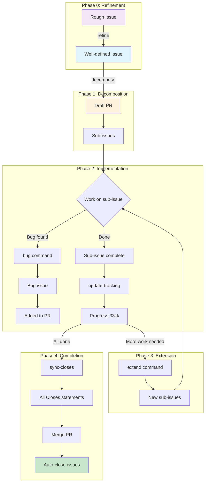

# Claude Code Toolkit

A collection of [Claude Code](https://docs.anthropic.com/en/docs/claude-code) skills, a global CLAUDE.md, and a project template for GitHub issue management, PR workflows, and development utilities.

## Philosophy

This toolkit separates concerns into three layers:

- **Skills** define **procedures** — the steps to follow when performing a task (e.g., how to implement an issue, how to decompose work)
- **Agents** define **constrained roles** — specialized sub-agents with restricted tool access for specific domains (e.g., read-only infrastructure analysis, deployment-scoped automation)
- **CLAUDE.md** defines **policies** — the standards and conventions that apply across all work (e.g., test quality, code quality, communication preferences)

Skills and agents reference policies from CLAUDE.md rather than duplicating them.

## Installation

```bash
git clone https://github.com/JanKeijzer/claude-code-toolkit.git ~/Projects/claude-code-toolkit
cd ~/Projects/claude-code-toolkit
./install.sh
```

This creates four symlinks:
- `~/.claude/skills` → `skills/` (all skills auto-discovered)
- `~/.claude/agents` → `agents/` (sub-agents auto-discovered)
- `~/.claude/bin` → `bin/` (helper scripts)
- `~/.claude/CLAUDE.md` → `claude-md/global.md` (global policies)

Restart Claude Code after installation. Skills are auto-discovered from `~/.claude/skills/*/SKILL.md`. Agents are auto-discovered from `~/.claude/agents/*.md`.

### Project Template

To set up a new project with a CLAUDE.md and settings:

```bash
# Project-specific policies
cp ~/Projects/claude-code-toolkit/claude-md/project-template.md /path/to/your/project/CLAUDE.md

# Project-specific permissions (remove comments and keep what applies)
mkdir -p /path/to/your/project/.claude
cp ~/Projects/claude-code-toolkit/claude-md/settings-template.jsonc /path/to/your/project/.claude/settings.json
```

Then fill in the sections relevant to your project. The settings template includes commented-out permissions for common tools (Docker, Python, Node, etc.) — uncomment what you need.

## Sub-Agents

The toolkit includes specialized sub-agents for issue creation, infrastructure management, and deployment. They work together with a clear separation of concerns:

```
Rough idea → issue-crafter → Well-defined issues → /decompose (if large) → /implement
                  ↑                                                             ↓
         /refine (existing issues)                                      devops-automator (deploy)
                                                                             ↑
infra-maintainer (advises) → GitHub issue → /implement (code) ───────────────┘
                                           ↑
                              or: human creates issue directly
```

| Agent | Role | Tools | Model |
|-------|------|-------|-------|
| `issue-crafter` | Translates rough ideas into well-structured GitHub issues. Asks clarifying questions, proposes issues for approval, then creates them. | Read, Grep, Glob, Bash, Write | Sonnet |
| `infra-maintainer` | Read-only infrastructure advisor. Analyzes, diagnoses, and recommends — never makes direct changes. | Read, Grep, Glob, Bash (diagnostics only) | Sonnet |
| `devops-automator` | Deployment engineer. The only path to production — always through the pipeline. | Read, Write, Edit, Grep, Glob, Bash | Sonnet |

### issue-crafter

Translates rough ideas and descriptions into well-structured GitHub issues. Explores the codebase for context, asks clarifying questions about scope and acceptance criteria, and presents structured proposals for approval before creating anything. Recommends `/decompose` for issues that are too large for a single PR.

**Workflow (create):** rough idea → codebase exploration → clarifying questions → issue proposal → human approval → `gh issue create`
**Workflow (refine):** existing issue → read & assess → interactive Q&A → updated proposal → human approval → `gh issue edit`

The `/refine` skill provides a shortcut to invoke the refine workflow for a specific issue.

### infra-maintainer

Infrastructure advisor for self-managed VPS servers. Operates in **read-only** mode (no Write/Edit tools). Runs diagnostic commands, assesses risks, and proposes improvements as GitHub issues (with `proposal` + `infra` labels) — but only after human confirmation.

**Analysis domains:** server hardening, reverse proxy & SSL, backup & disaster recovery, monitoring & uptime, Docker management, security updates & vulnerability management.

### devops-automator

Deployment engineer responsible for CI/CD pipelines and the path to production. Every change follows the same path: branch → test → PR → review → merge → deploy. No exceptions.

**Scope:** GitHub Actions workflows, deployment strategies (lightweight restart vs. full rebuild), Docker image management, environment & secret management, branch protection rules.

### Why no "software engineer" agent?

Agents are valuable because of their **constraints**: infra-maintainer is read-only, devops-automator is deployment-scoped. A "software engineer" agent would need all tools with no specific restrictions — that's just Claude Code itself. The `/implement` skill already encapsulates the full workflow: issue → branch → code + tests → PR.

## Helper Scripts

The `bin/` directory contains reusable shell scripts that skills call instead of using inline `for` loops.

**Why?** Claude Code permissions match on the **first word** of a Bash command. An inline loop like `for issue in 15 16 17; do gh issue view $issue ...; done` gets blocked because the first word is `for`, not `gh`. By wrapping batch operations in scripts, permissions can match on the script path (`~/.claude/bin/*`).

| Script | Usage | Description |
|--------|-------|-------------|
| `batch-issue-view.sh` | `batch-issue-view.sh <repo> <issues...>` | Fetch full issue details as JSON array |
| `batch-issue-status.sh` | `batch-issue-status.sh <repo> <issues...>` | Fetch issue number/state/closed as JSON array |
| `git-find-base-branch` | `git-find-base-branch` | Detect the base branch of the current branch |
| `git-cleanup-merged-branch.sh` | `git-cleanup-merged-branch.sh [feature] [base]` | Checkout base, pull, delete merged feature branch |
| `batch-pr-for-issues.sh` | `batch-pr-for-issues.sh <repo> <issues...>` | Find merged/open PRs linked to issues |
| `find-tracking-pr.sh` | `find-tracking-pr.sh <repo> <issue>` | Find the tracking PR for a parent issue |
| `extract-issue-from-branch.sh` | `extract-issue-from-branch.sh` | Extract issue number from current branch name |

To allow these scripts in your project's `.claude/settings.json`:

```json
{
  "permissions": {
    "allow": [
      "Bash(~/.claude/bin/*)"
    ]
  }
}
```

## Repository Structure

```
claude-code-toolkit/
├── agents/                    ← sub-agent definitions
│   ├── issue-crafter.md       ← idea → well-defined GitHub issues
│   ├── infra-maintainer.md    ← read-only infrastructure advisor
│   └── devops-automator.md    ← deployment engineer
├── bin/                       ← helper scripts (batch operations, git utilities)
│   ├── batch-issue-view.sh    ← fetch multiple issues as JSON array
│   ├── batch-issue-status.sh  ← fetch issue status as JSON array
│   ├── git-find-base-branch   ← detect base branch of current branch
│   ├── git-cleanup-merged-branch.sh ← cleanup after PR merge
│   ├── batch-pr-for-issues.sh ← find merged/open PRs linked to issues
│   ├── find-tracking-pr.sh   ← find tracking PR for a parent issue
│   └── extract-issue-from-branch.sh ← extract issue number from branch name
├── skills/                    ← skill definitions (procedures)
│   ├── refine/
│   ├── implement/
│   ├── decompose/
│   ├── bug/
│   ├── cleanup/
│   ├── extend/
│   ├── finish/
│   ├── help-issues/
│   ├── ss/
│   ├── sync-closes/
│   └── update-tracking/
├── claude-md/                 ← CLAUDE.md files (policies)
│   ├── global.md              ← global policies → ~/.claude/CLAUDE.md
│   ├── project-template.md    ← template for project-specific CLAUDE.md
│   └── settings-template.jsonc ← template for project-specific settings
├── install.sh                 ← creates symlinks
└── README.md
```

## CLAUDE.md Files

### Global (`claude-md/global.md`)

Symlinked to `~/.claude/CLAUDE.md`, applies to all projects. Contains:

- **General Preferences** — language and communication conventions
- **Test Quality Policy** — mocks, fixtures, test value standards
- **Anti-Patterns** — things to always avoid
- **Code Quality** — verification-before-coding rules

### Project Template (`claude-md/project-template.md`)

Copy to a project root as `CLAUDE.md` and fill in:

- Project overview, tech stack, project structure
- Development commands (run, test, lint, validate)
- API and database conventions
- Project-specific patterns and deployment notes

### Settings Template (`claude-md/settings-template.jsonc`)

Copy to `.claude/settings.json` in your project. Contains commented-out permissions for common tools (Docker, Python, Node, project scripts) and safe deny-defaults for destructive git operations. Uncomment what applies to your project.

Global permissions (git, gh, edit, file operations) are in `~/.claude/settings.json` — don't repeat them in project settings.

## All Skills

| Skill | Syntax | Description |
|-------|--------|-------------|
| `/refine` | `/refine <issue>` | Refine a GitHub issue through interactive Q&A to sharpen scope and criteria |
| `/decompose` | `/decompose <issue>` | Break down a large issue into sub-issues with a tracking PR |
| `/extend` | `/extend <issue>` | Add more sub-issues to an existing tracking PR |
| `/implement` | `/implement <issue>` | Implement a GitHub issue with automated PR creation |
| `/finish` | `/finish [issue] [base]` | Commit, close issue, merge to base branch, cleanup |
| `/bug` | `/bug "<title>"` | Create a bug sub-issue and add it to the tracking PR |
| `/update-tracking` | `/update-tracking <pr>` | Update tracking PR with current sub-issue status |
| `/sync-closes` | `/sync-closes <pr>` | Sync all Closes statements in tracking PR |
| `/cleanup` | `/cleanup` | Clean up after merging a PR (checkout base, delete branch) |
| `/help-issues` | `/help-issues` | Show quick reference for issue management |
| `/ss` | `/ss [number]` | Find recent screenshots |

---

## Issue Management Quick Reference

| Skill | Syntax | When to Use |
|-------|--------|-------------|
| `/refine` | `/refine <issue>` | Sharpen scope & acceptance criteria |
| `/decompose` | `/decompose <issue>` | Start: break down large issue |
| `/extend` | `/extend <issue>` | Later: add more sub-issues |
| `/bug` | `/bug "<title>"` | Bug found during work |
| `/update-tracking` | `/update-tracking <pr>` | Update status table |
| `/sync-closes` | `/sync-closes <pr>` | Sync Closes statements |

---

## Workflow Overview



---

## Skills in Detail

### 1. `/decompose` - Break Down Issue

**When:** You have a large issue that's too complex for a single PR.

**What it does:**
1. Fetches issue and analyzes its structure
2. Proposes sub-issues based on phases/tasks
3. Creates a draft tracking PR
4. Creates sub-issues (after confirmation)
5. Adds all `Closes #XXX` statements

**Syntax:**
```bash
/decompose 723
```

**Example output:**
```
Analyzing issue #723: Stripe Payment Provider

Proposed breakdown:
| # | Sub-Issue | Scope |
|---|-----------|-------|
| 1 | Phase 1: Abstraction Layer | Backend |
| 2 | Phase 2: Stripe Integration | Backend |
| 3 | Phase 3: Frontend Updates | Frontend |

Create draft PR and sub-issues? (A/B/C)
```

---

### 2. `/extend` - Add More Sub-Issues

**When:** You've completed the first batch of sub-issues and want to tackle the next phase.

**What it does:**
1. Finds existing tracking PR
2. Analyzes which tasks don't have sub-issues yet
3. Proposes new sub-issues
4. Adds to tracking PR

**Syntax:**
```bash
/extend 723        # Explicit issue number
/extend            # Detect from branch
```

**Difference from /decompose:**

| Aspect | /decompose | /extend |
|--------|-----------|---------|
| Creates PR | Yes (new) | No (updates existing) |
| Focus | Everything | Only remaining tasks |

---

### 3. `/bug` - Create Bug Issue

**When:** You find a bug while working on a sub-issue.

**What it does:**
1. Detects parent issue from branch (or explicit)
2. Creates bug issue with 🐛 prefix
3. Adds to tracking PR
4. Updates `Closes #XXX` statements

**Syntax:**
```bash
/bug "Webhook signature fails"           # Parent from branch
/bug 724 "Webhook signature fails"       # Explicit parent #724
```

**Example:**
```
$ git branch
issue-724-stripe-webhook

$ /bug "Signature verification fails in test mode"

✅ Created: #730 - 🐛 [Parent #724] Bug: Signature verification fails
✅ Added to tracking PR #727
✅ Will auto-close on merge
```

---

### 4. `/update-tracking` - Update Status

**When:** You want to update the progress in the tracking PR.

**What it does:**
1. Checks status of all sub-issues
2. Finds merged PRs
3. Updates the status table
4. Calculates progress percentage

**Syntax:**
```bash
/update-tracking 727
```

**Status indicators:**
| Emoji | Meaning |
|-------|---------|
| ⏳ | Pending - not started |
| 🔄 | In Progress - has open PR |
| ✅ | Complete - issue closed |
| ❌ | Blocked |
| 🎉 | 100% done |

---

### 5. `/sync-closes` - Sync Closes Statements

**When:** Before merging, to ensure all issues will auto-close.

**What it does:**
1. Finds all sub-issues in tracking table
2. Compares with `Closes #XXX` statements
3. Adds missing ones

**Syntax:**
```bash
/sync-closes 727
```

**Example:**
```
Current Closes: #723, #724, #725
Found in table: #723, #724, #725, #730 (bug)

Missing: #730

Add "Closes #730" to PR? (y/n)
```

---

## Complete Example Workflow

### Step 1: Start with large issue

```bash
# Issue #723: Stripe Payment Provider (large, 5 phases)
/decompose 723

# Output:
# ✅ Created draft PR #727
# ✅ Created sub-issues: #724, #725, #726
# ✅ Progress: 0/3 (0%)
```

### Step 2: Work on first sub-issues

```bash
git checkout -b issue-724-abstraction-layer
# ... implement ...
# Create PR, merge to issue-723-stripe branch
```

### Step 3: Bug found!

```bash
# On branch issue-724-abstraction-layer
/bug "Factory pattern doesn't work with async"

# Output:
# ✅ Created #730 - 🐛 Bug: Factory pattern doesn't work
# ✅ Added to PR #727
```

### Step 4: Update progress

```bash
/update-tracking 727

# Output:
# #724 - Abstraction: ⏳ → ✅ (PR #731 merged)
# #725 - Stripe: ⏳ → 🔄 (PR #732 open)
# #730 - Bug: ⏳ → ✅ (fixed in #731)
# Progress: 2/4 (50%)
```

### Step 5: Add next phase

```bash
/extend 723

# Output:
# Existing: #724 ✅, #725 🔄, #726 ⏳, #730 ✅
# Remaining tasks: Phase 4 (Frontend), Phase 5 (Testing)
#
# Create #733, #734? (y/n)
```

### Step 6: Sync before merge

```bash
/sync-closes 727

# Output:
# All 7 issues have Closes statements ✅
# Ready to merge!
```

### Step 7: Merge

```bash
# Merge PR #727 → develop
# Auto-closes: #723, #724, #725, #726, #730, #733, #734
```

---

## Hierarchy Structure

```
#723 (Parent Issue)
│
├── PR #727 (Tracking PR)
│   ├── Closes #723
│   ├── Closes #724
│   ├── Closes #725
│   └── ...
│
├── #724 (Sub-issue: Phase 1)
│   └── #730 (Bug found in #724)
│
├── #725 (Sub-issue: Phase 2)
│
├── #726 (Sub-issue: Phase 3)
│
└── #733, #734 (Added later via /extend)
```

---

## Tips

1. **Start small**: Decompose into 3-5 sub-issues first, extend later
2. **Update regularly**: Run `/update-tracking` after each merge
3. **Sync before merge**: Always `/sync-closes` before final merge
4. **Branch naming**: Use `issue-XXX-description` for auto-detection
5. **Inline bugs**: Fix small bugs in current branch, only create issues for larger bugs

---

## Skill Format

Each skill is a directory containing a `SKILL.md` file with YAML frontmatter:

```yaml
---
name: my-skill
description: What this skill does
argument-hint: <required-arg> [optional-arg]
user-invocable: true
---

Instructions for Claude Code when the skill is invoked...
```

## License

MIT
