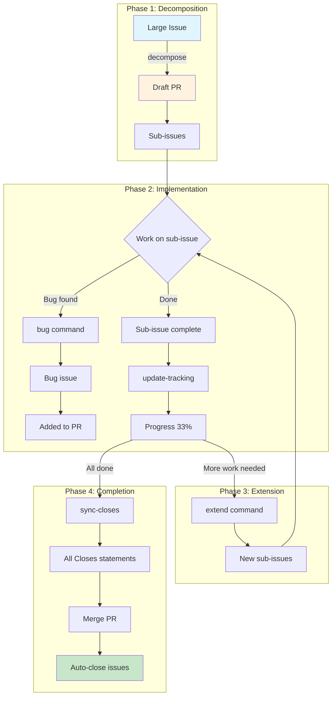

# Claude Code Skills

A collection of [Claude Code](https://docs.anthropic.com/en/docs/claude-code) skills for GitHub issue management, PR workflows, and development utilities.

## Installation

```bash
git clone https://github.com/<your-username>/claude-code-skills.git ~/Projects/claude-code-skills
ln -s ~/Projects/claude-code-skills ~/.claude/skills
```

Restart Claude Code after installation. Skills are auto-discovered from `~/.claude/skills/*/SKILL.md`.

## All Skills

| Skill | Syntax | Description |
|-------|--------|-------------|
| `/decompose` | `/decompose <issue>` | Break down a large issue into sub-issues with a tracking PR |
| `/extend` | `/extend <issue>` | Add more sub-issues to an existing tracking PR |
| `/implement` | `/implement <issue>` | Implement a GitHub issue with automated PR creation |
| `/finish` | `/finish [issue] [base]` | Commit, close issue, merge to base branch, cleanup |
| `/bug` | `/bug "<title>"` | Create a bug sub-issue and add it to the tracking PR |
| `/update-tracking` | `/update-tracking <pr>` | Update tracking PR with current sub-issue status |
| `/sync-closes` | `/sync-closes <pr>` | Sync all Closes statements in tracking PR |
| `/cleanup` | `/cleanup` | Clean up after merging a PR (checkout base, delete branch) |
| `/help-issues` | `/help-issues` | Show quick reference for issue management |
| `/ss` | `/ss [number]` | Find recent screenshots |

---

## Issue Management Quick Reference

| Skill | Syntax | When to Use |
|-------|--------|-------------|
| `/decompose` | `/decompose <issue>` | Start: break down large issue |
| `/extend` | `/extend <issue>` | Later: add more sub-issues |
| `/bug` | `/bug "<title>"` | Bug found during work |
| `/update-tracking` | `/update-tracking <pr>` | Update status table |
| `/sync-closes` | `/sync-closes <pr>` | Sync Closes statements |

---

## Workflow Overview



---

## Skills in Detail

### 1. `/decompose` - Break Down Issue

**When:** You have a large issue that's too complex for a single PR.

**What it does:**
1. Fetches issue and analyzes its structure
2. Proposes sub-issues based on phases/tasks
3. Creates a draft tracking PR
4. Creates sub-issues (after confirmation)
5. Adds all `Closes #XXX` statements

**Syntax:**
```bash
/decompose 723
```

**Example output:**
```
Analyzing issue #723: Stripe Payment Provider

Proposed breakdown:
| # | Sub-Issue | Scope |
|---|-----------|-------|
| 1 | Phase 1: Abstraction Layer | Backend |
| 2 | Phase 2: Stripe Integration | Backend |
| 3 | Phase 3: Frontend Updates | Frontend |

Create draft PR and sub-issues? (A/B/C)
```

---

### 2. `/extend` - Add More Sub-Issues

**When:** You've completed the first batch of sub-issues and want to tackle the next phase.

**What it does:**
1. Finds existing tracking PR
2. Analyzes which tasks don't have sub-issues yet
3. Proposes new sub-issues
4. Adds to tracking PR

**Syntax:**
```bash
/extend 723        # Explicit issue number
/extend            # Detect from branch
```

**Difference from /decompose:**

| Aspect | /decompose | /extend |
|--------|-----------|---------|
| Creates PR | Yes (new) | No (updates existing) |
| Focus | Everything | Only remaining tasks |

---

### 3. `/bug` - Create Bug Issue

**When:** You find a bug while working on a sub-issue.

**What it does:**
1. Detects parent issue from branch (or explicit)
2. Creates bug issue with 🐛 prefix
3. Adds to tracking PR
4. Updates `Closes #XXX` statements

**Syntax:**
```bash
/bug "Webhook signature fails"           # Parent from branch
/bug 724 "Webhook signature fails"       # Explicit parent #724
```

**Example:**
```
$ git branch
issue-724-stripe-webhook

$ /bug "Signature verification fails in test mode"

✅ Created: #730 - 🐛 [Parent #724] Bug: Signature verification fails
✅ Added to tracking PR #727
✅ Will auto-close on merge
```

---

### 4. `/update-tracking` - Update Status

**When:** You want to update the progress in the tracking PR.

**What it does:**
1. Checks status of all sub-issues
2. Finds merged PRs
3. Updates the status table
4. Calculates progress percentage

**Syntax:**
```bash
/update-tracking 727
```

**Status indicators:**
| Emoji | Meaning |
|-------|---------|
| ⏳ | Pending - not started |
| 🔄 | In Progress - has open PR |
| ✅ | Complete - issue closed |
| ❌ | Blocked |
| 🎉 | 100% done |

---

### 5. `/sync-closes` - Sync Closes Statements

**When:** Before merging, to ensure all issues will auto-close.

**What it does:**
1. Finds all sub-issues in tracking table
2. Compares with `Closes #XXX` statements
3. Adds missing ones

**Syntax:**
```bash
/sync-closes 727
```

**Example:**
```
Current Closes: #723, #724, #725
Found in table: #723, #724, #725, #730 (bug)

Missing: #730

Add "Closes #730" to PR? (y/n)
```

---

## Complete Example Workflow

### Step 1: Start with large issue

```bash
# Issue #723: Stripe Payment Provider (large, 5 phases)
/decompose 723

# Output:
# ✅ Created draft PR #727
# ✅ Created sub-issues: #724, #725, #726
# ✅ Progress: 0/3 (0%)
```

### Step 2: Work on first sub-issues

```bash
git checkout -b issue-724-abstraction-layer
# ... implement ...
# Create PR, merge to issue-723-stripe branch
```

### Step 3: Bug found!

```bash
# On branch issue-724-abstraction-layer
/bug "Factory pattern doesn't work with async"

# Output:
# ✅ Created #730 - 🐛 Bug: Factory pattern doesn't work
# ✅ Added to PR #727
```

### Step 4: Update progress

```bash
/update-tracking 727

# Output:
# #724 - Abstraction: ⏳ → ✅ (PR #731 merged)
# #725 - Stripe: ⏳ → 🔄 (PR #732 open)
# #730 - Bug: ⏳ → ✅ (fixed in #731)
# Progress: 2/4 (50%)
```

### Step 5: Add next phase

```bash
/extend 723

# Output:
# Existing: #724 ✅, #725 🔄, #726 ⏳, #730 ✅
# Remaining tasks: Phase 4 (Frontend), Phase 5 (Testing)
#
# Create #733, #734? (y/n)
```

### Step 6: Sync before merge

```bash
/sync-closes 727

# Output:
# All 7 issues have Closes statements ✅
# Ready to merge!
```

### Step 7: Merge

```bash
# Merge PR #727 → develop
# Auto-closes: #723, #724, #725, #726, #730, #733, #734
```

---

## Hierarchy Structure

```
#723 (Parent Issue)
│
├── PR #727 (Tracking PR)
│   ├── Closes #723
│   ├── Closes #724
│   ├── Closes #725
│   └── ...
│
├── #724 (Sub-issue: Phase 1)
│   └── #730 (Bug found in #724)
│
├── #725 (Sub-issue: Phase 2)
│
├── #726 (Sub-issue: Phase 3)
│
└── #733, #734 (Added later via /extend)
```

---

## Tips

1. **Start small**: Decompose into 3-5 sub-issues first, extend later
2. **Update regularly**: Run `/update-tracking` after each merge
3. **Sync before merge**: Always `/sync-closes` before final merge
4. **Branch naming**: Use `issue-XXX-description` for auto-detection
5. **Inline bugs**: Fix small bugs in current branch, only create issues for larger bugs

---

## Skill Format

Each skill is a directory containing a `SKILL.md` file with YAML frontmatter:

```yaml
---
name: my-skill
description: What this skill does
argument-hint: <required-arg> [optional-arg]
user-invocable: true
---

Instructions for Claude Code when the skill is invoked...
```

## License

MIT
